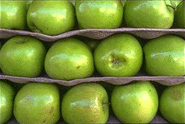
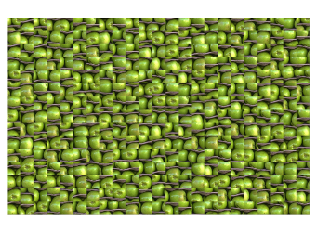
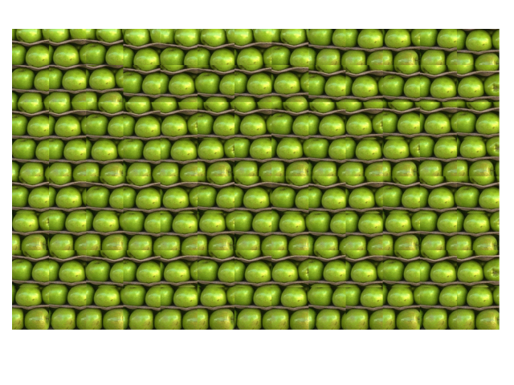
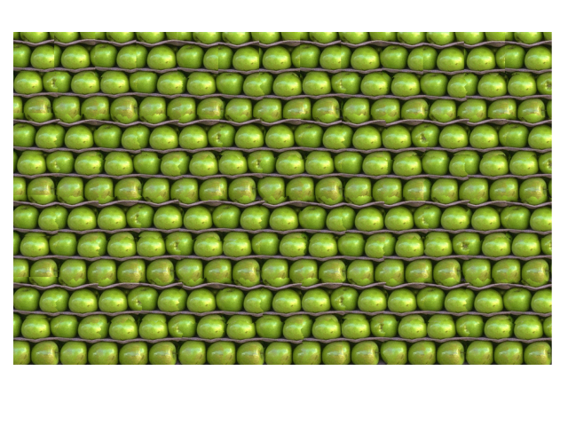
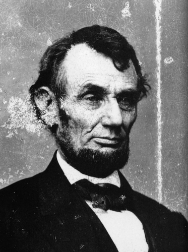
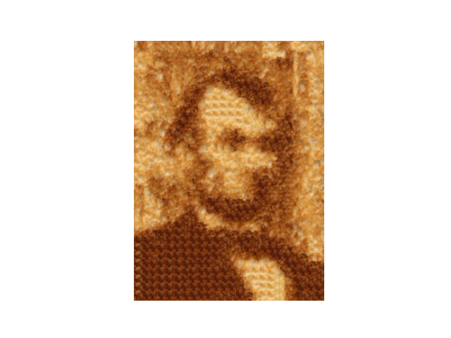

# Texture-Synthesis-and-Transfer

Implementation of `Image Quilting for Texture Synthesis and Transfer`. 
Original paper is included in the repo.
Results can be viewed in the `report` pdf along with individual outputs in the `data` folder. 

Preview: 
Original texture: \

Method 1 synthesis: \

Method 2 synthesis: \

Method 3 synthesis: \

Texture transfer: \
 \
